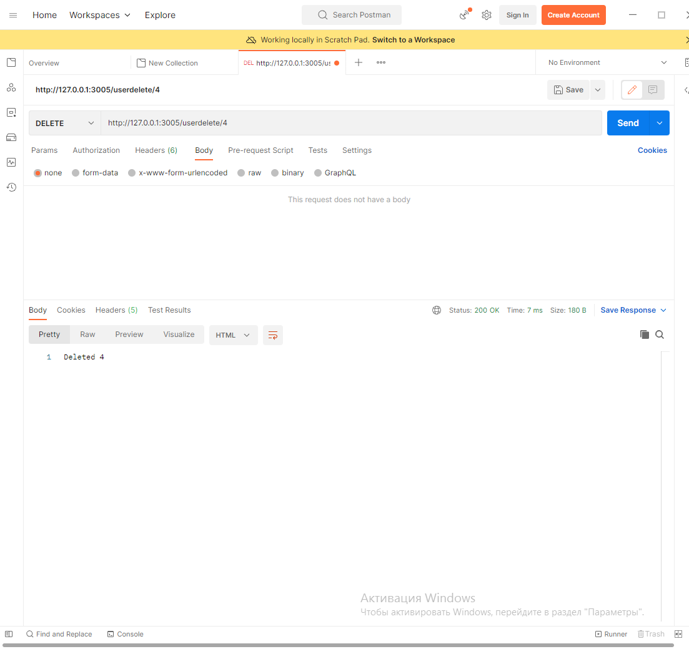

# FLASK API

Документ описывает запросы, которые *адекватно* может обработать API.

### Формат JSON

> Документ может включать в себя параметры ***name*** и ***password***, тип переменных *string*.

### Доступные методы:

- ***GET***

	> Позволяет получить всех пользователей в виде 
	> списка JSON объектов.

	- ID пользователя
	- Имя пользователя
	- Пароль пользователя
	
	**URL: http://localhost:3005/music**
	
	

- ***POST***

	> Позволяет добавить пользователя 
	> в базу данных.

	*Принимает строго указанный формат JSON.*
	
	**URL: http://localhost:3005/music**
	
	

- ***PUT***

	> Позволяет изменить данные пользователя
	> с указанным ID.

	*Пароль или логин может быть не указан,
	и он не подвергнется изменению*
	
	**URL: http://localhost:3005/music/id**
	
	

- ***DELETE***

	> Позволяет удалить пользователя
	> с указанным ID.

	**URL: http://localhost:3005/music/id**
	
	

